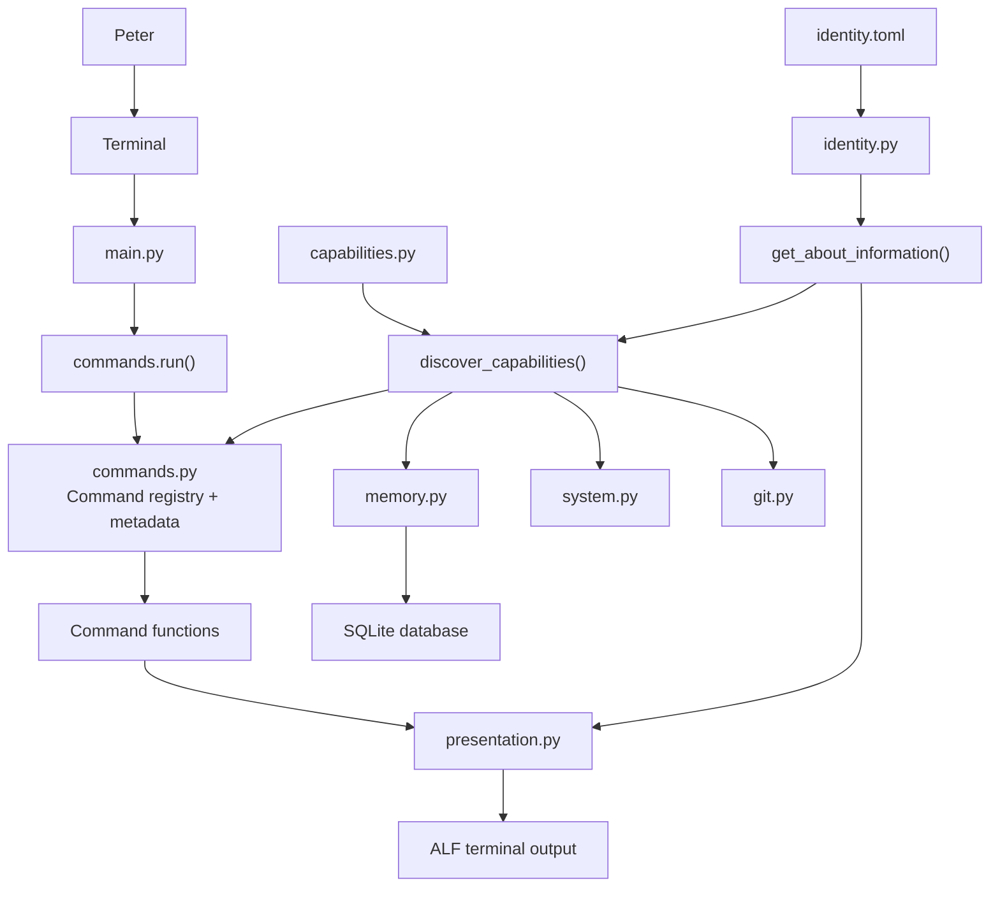

# ALF Architecture

> This diagram is a mental model of ALF's architecture.
>
> It is not a complete dependency graph.
>
> Update it when the architecture changes, not every commit.



## Core idea

ALF subsystems advertise themselves through capabilities.

A subsystem does not need to be manually registered.

It provides:

```python
def get_capability():
    ...
```

and ALF discovers it.

Current capability providers:

- `commands.py`
- `memory.py`
- `system.py`
- `git.py`

## Design principle

ALF should consume metadata rather than duplicate knowledge.

Interfaces should ask ALF:

> "What can you do?"

rather than maintain their own list of capabilities.
